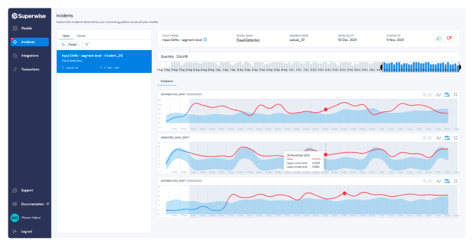

<div align="center">


**A quickstart guide for integrating Machine Learning workflows with Superwise.ai platform**</br>  


<p align="center">
  <a href="https://superwise.ai">Official</a> •
  <a href="https://docs.superwise.ai/">Docs</a> •
  <a href="https://github.com/superwise-ai/integration/blob/main/getting_started/quickstart.ipynb">Getting Started</a> •
  <a href="https://www.superwise.ai/resources/blog">Blog</a> •
  <a href="https://www.linkedin.com/company/superwise-ai/">LinkedIn</a> •
  <a href="">Slack</a>
</p>



# Model observability built for scale
**From missing values to concept drift, Superwise makes sense of models in production, so teams know when models misbehave, what happened, and what to do next.**

<div align="left">


## Installation
```pip install superwise```

## How to start
1. Signup to [Superwise.ai](https://portal.superwise.ai/account/sign-up) Platform
2. Follow [Getting Started](./getting_started/quickstart.ipynb) notebook ( Jupyter\Google Colab )
3. Observe your models :)

## Integrations
1. Google Vertex [Guide](./getting_started/vertex.ipynb)
2. AWS Sagemaker [Guide](./getting_started/sagemaker.ipynb)

## License
The use of this quickstart tutorial is completely free and open-source under the [MIT](LICENSE.md) license.
